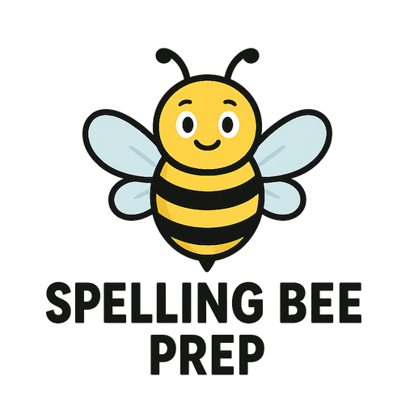
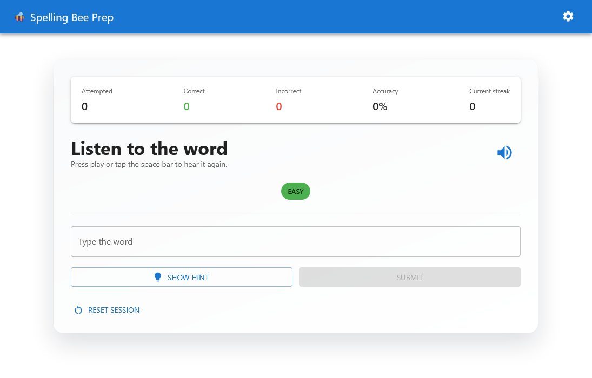

# Spelling Bee Prep 🐝

Help your child master spelling with an interactive, voice-enabled practice app! This web application makes spelling practice fun and effective with spoken words, helpful hints, and progress tracking.

<p align="center">
  
</p>

---

## 🚀 Getting Started for Parents

### What You Need

- A computer with [Node.js](https://nodejs.org/) installed (download the LTS version)
- A web browser (Chrome, Firefox, Edge, or Safari)
- About 5 minutes to set up

### Installation Steps

1. **Download this project** to your computer (or clone it if you're familiar with Git)

2. **Open a terminal or command prompt** and navigate to the project folder

3. **Install the required files** (only needed once):

   ```bash
   npm install
   ```

4. **Start the app**:

   ```bash
   npm run dev
   ```

5. **Open your browser** and go to `http://localhost:5173`

That's it! Your child can now start practicing spelling.

---

## 📖 How to Use the App

### Basic Practice Flow

1. **Click the speaker button** 🔊 to hear the word spoken aloud
2. **Type the word** in the answer field
3. **Press Enter** or click "Check Answer"
4. **See if you got it right** - green means correct, red means try again!
5. **Click "Next Word"** to continue practicing

### Helpful Features

- **Hints Button** 💡: Click to see the word's definition, example sentence, or origin
- **Play Again** 🔊: Hear the word repeated as many times as needed
- **Difficulty Filters**: Choose Easy, Medium, or Hard words (or mix them!)
- **Progress Tracking**: See your accuracy, current streak, and improvement over time
- **Charts & Insights**: Visual graphs show your child's progress and which difficulty levels need more practice

### Settings

Click the **gear icon** ⚙️ in the top-right corner to adjust:

- **Speech Rate**: Make the voice speak slower or faster
- **Volume**: Adjust how loud the words are spoken
- **Language**: Currently English (more languages can be added)

---

## 📝 How to Add Your Own Spelling Words

The app comes with a small set of sample words, but you'll want to add your child's spelling list! Here's how:

### Step 1: Find the Word List File

Open the file: `src/data/loaders/DefaultDataLoader.ts`

### Step 2: Add Your Words

Each word follows this format:

```typescript
{
  word: 'example',           // The word to spell
  difficulty: Difficulty.EASY,  // EASY, MEDIUM, or HARD
  definition: 'A thing that shows what something is like',
  usageExample: 'This is an example of how to use the word.',
  category: 'education',     // Any category you like
  origin: 'From Latin',      // Optional - where the word comes from
}
```

### Step 3: Real Example - Adding a Week's Spelling Words

```typescript
export const DEFAULT_WORDS: WordEntry[] = [
  {
    word: 'friend',
    difficulty: Difficulty.EASY,
    definition: 'A person you know well and like',
    usageExample: 'My best friend lives next door.',
    category: 'social',
  },
  {
    word: 'school',
    difficulty: Difficulty.EASY,
    definition: 'A place where children go to learn',
    usageExample: 'I go to school every weekday.',
    category: 'education',
  },
  {
    word: 'wonderful',
    difficulty: Difficulty.MEDIUM,
    definition: 'Extremely good or impressive',
    usageExample: 'We had a wonderful time at the park.',
    category: 'adjective',
  },
  // Add more words here following the same pattern
];
```

### Tips for Adding Words

- **Copy and paste** an existing word entry and modify it
- Put **easier words** at the top for younger children
- Include the **definition and example** - these appear as hints during practice
- Use difficulty levels to match your child's grade:
  - `Difficulty.EASY` - Kindergarten to 2nd grade
  - `Difficulty.MEDIUM` - 3rd to 5th grade
  - `Difficulty.HARD` - 6th grade and up
- **Save the file** and the app will automatically reload with the new words!

### Need Help?

- Make sure each word entry ends with a comma (except the last one)
- Keep the `export const DEFAULT_WORDS: WordEntry[] = [` line at the top
- Keep the `];` at the very end
- If something goes wrong, check the browser console for error messages

---

## ✨ What Makes This App Great for Kids

### 🎯 Multiple Practice Modes

- **Random Practice**: Words appear in random order to keep practice fresh
- **Filter by Difficulty**: Focus on Easy, Medium, or Hard words based on your child's level
- **No Repeats**: Words won't repeat until your child has practiced all the selected words

### 🔊 Voice Features

- **Automatic Speech**: Every word is spoken aloud automatically
- **Repeat Anytime**: Click the speaker button to hear the word again
- **Adjustable Speed**: Slow down the speech for challenging words
- **Works Offline**: Once loaded, the app works without an internet connection

### 💡 Learning Support

- **Multiple Hint Types**: View definitions, example sentences, or word origins
- **Instant Feedback**: See immediately if the answer is correct
- **Encouraging Stats**: Track progress with accuracy percentages and streak counters
- **Visual Progress**: Colorful charts show improvement over time

### 📊 Parent-Friendly Features

- **Practice History**: All attempts are saved so you can review progress
- **Performance Charts**: See which difficulty levels need more work
- **Accuracy Tracking**: Monitor improvement with percentage-based statistics
- **Time-Based Trends**: Watch your child's cumulative progress over days and weeks

### 💻 Works Everywhere

- **Any Device**: Use on desktop, tablet, or smartphone
- **Any Browser**: Works in Chrome, Firefox, Edge, and Safari
- **Keyboard Friendly**: Your child can practice without touching the mouse
- **Install as an App**: Add to your home screen for quick access
- **Offline Mode**: Practice anywhere, even without internet

---

## 🎨 What It Looks Like



The practice screen is clean and distraction-free, with big buttons for listening, hints, and checking answers. Progress stats appear at the top, and colorful charts show improvement over time.

---

## 🎓 Tips for Effective Practice

### For Best Results

1. **Practice regularly**: 10-15 minutes daily is better than one long session
2. **Start with Easy**: Build confidence before moving to harder words
3. **Use hints strategically**: Encourage your child to try first, then use hints
4. **Review the charts**: Discuss which words need more practice
5. **Celebrate streaks**: Make getting 5 or 10 in a row a mini-celebration!

### Making It Fun

- Set a daily goal (e.g., "Let's get 20 words correct today!")
- Have your child beat their own high streak
- Practice together and take turns
- Use the charts to show progress over the week
- Create friendly competitions with siblings

---

## 🔧 Troubleshooting

### The voice isn't working

- Make sure your computer's volume is turned up
- Try adjusting the volume in the Settings (gear icon)
- Check that your browser allows sound (look for a speaker icon in the address bar)
- Reload the page and try again

### I added words but they're not showing up

- Make sure you saved the `DefaultDataLoader.ts` file
- Check that each word entry has a comma at the end (except the last one)
- Refresh your browser (press F5 or Ctrl+R)
- Check the browser console (F12) for any red error messages

### The app won't start

- Make sure you ran `npm install` first
- Check that Node.js is installed correctly (type `node --version` in your terminal)
- Try stopping the app (Ctrl+C) and running `npm run dev` again
- Close other applications that might be using port 5173

### Need more help?

Open an issue on GitHub or check the Contributing section below for ways to get support.

---

## 🤝 Contributing & Support

We'd love your help making this app even better! Whether you're a parent with ideas or a developer who wants to contribute:

1. **Share feedback**: Open an issue with suggestions or problems
2. **Report bugs**: Let us know if something isn't working
3. **Add features**: Fork the repository and submit a pull request
4. **Share word lists**: Contribute commonly used spelling bee word lists

---

## 🔒 Privacy & Security

Your child's privacy matters:

- **No data collection**: Nothing is sent to external servers
- **Local storage only**: All practice history stays on your computer
- **No tracking**: No analytics or tracking scripts
- **Safe & secure**: Built with modern security best practices

For technical details, see [SECURITY.md](./SECURITY.md).

---

## 📚 For Developers

### Technology Overview

This app is built with modern web technologies for performance and maintainability:

- **Frontend**: React 19 with TypeScript 5.9
- **Build Tool**: Vite 7 with hot module replacement
- **UI Framework**: Material UI 7 with Emotion styling
- **State Management**: Zustand 5 stores
- **Text-to-Speech**: Web Speech API with eSpeak WASM and OpenTTS fallbacks
- **Testing**: Vitest 4 (unit), Playwright (E2E)
- **Code Quality**: ESLint 9, Prettier 3, TypeScript strict mode
- **PWA**: vite-plugin-pwa with Workbox caching

### Quick Development Setup

```bash
npm install              # Install dependencies
npm run dev              # Start development server at http://localhost:5173
npm test                 # Run unit tests in watch mode
npm run test:e2e         # Run end-to-end tests with Playwright
npm run lint             # Check code quality with ESLint
npm run format           # Format code with Prettier
npm run build            # Build for production
```

### Codebase Structure

```text
src/
├── app/                 # Application root & context providers (Theme, i18n)
├── components/          # Reusable UI components (controls, feedback, layout)
├── features/practice/   # Main practice feature with insights/analytics
├── data/loaders/        # Word dictionaries (⭐ Customize spelling words here!)
├── services/            # TTS and dictionary service implementations
├── store/               # Zustand stores (practice session & settings)
├── utils/               # Helper functions, type guards, storage utilities
└── types/               # TypeScript type definitions and schemas
```

### Key Files for Customization

- **Add Words**: `src/data/loaders/DefaultDataLoader.ts` - Main word dictionary
- **Styling**: `src/styles/theme.ts` - Material UI theme configuration
- **Translations**: `src/i18n/en/common.json` - UI text and labels
- **Settings**: `src/store/settingsStore.ts` - Default TTS and locale settings

### Architecture Highlights

- **Component-based**: Functional components with React hooks
- **Type-safe**: Full TypeScript coverage with strict mode enabled
- **State management**: Zustand for global state (practice session, user settings)
- **Service layer**: Abstracted TTS and dictionary services with multiple implementations
- **Local-first**: All data stored in browser LocalStorage, no external dependencies
- **Progressive Web App**: Service worker enables offline usage and installation
- **Tested**: Unit tests for business logic, E2E tests for user workflows

### Contributing

We welcome contributions! The codebase follows React and TypeScript best practices:

- Add new components to `src/components/` or `src/features/`
- Business logic belongs in `src/store/` or `src/services/`
- All new code should include TypeScript types
- Run tests and linters before submitting PRs
- Follow the existing code style (Prettier will help!)

For detailed technical documentation, see the inline JSDoc comments throughout the codebase.

---

## 📄 License

Released under the Apache-2.0 License. Happy spelling! 🎉
